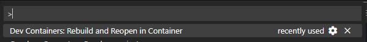
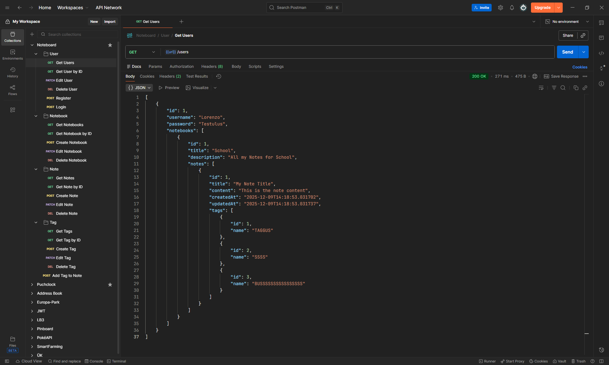

# Noteboard

### How to run the Application in VSCode

1. Install the following Extensions:

    - [Quarkus Extension](https://marketplace.visualstudio.com/items?itemName=redhat.vscode-quarkus)
    - [Dev Containers Extension](https://marketplace.visualstudio.com/items?itemName=ms-vscode-remote.remote-containers)

2. Make sure Docker is running

3. Press `F1` and type: `Dev Containers: Rebuild and Reopen in Container`

    

4. Once VSCode has reopened inside the Container, wait until the project has finished initializing.

5. Type `./mvnw quarkus:dev` inside a terminal to run the application

## 2025-11-28 | Beginn

-   Models und Repositories definiert

## 2025-12-05

-   Services und Controller definiert

## 2025-12-12

-   Models angepasst damit keine Konflikte bei Referenzen entstehen

## 2025-12-19

-   Verschiedene Helpers implementiert

## 2025-12-26 | Ferien

-   Mit Postman versucht alle Endpoints aufzurufen

    

## 2026-01-02 | Ferien

-   Tests geschrieben

## 2026-01-09

-   Tests & gesamte Applikation nochmals überprüft

## 2026-01-16 | Abgabe

-   Fertigstellung des Lernjournals
